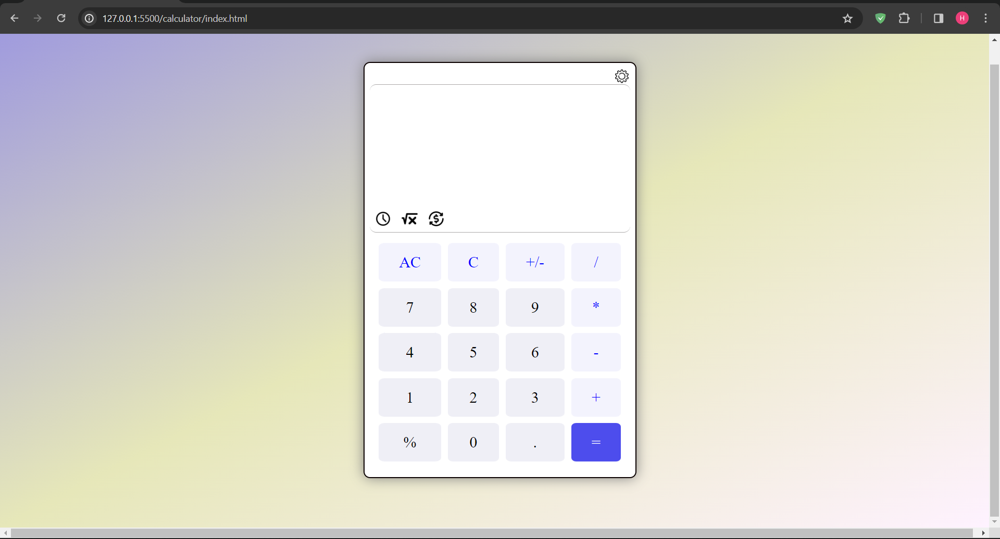

# Simple Calculator Project

Welcome to the Simple Calculator project! This hands-on JavaScript project brings the power of computation to your fingertips, allowing you to perform basic arithmetic operations with ease.

## Project Highlights:

- **Interactive Calculations**: Engage with an intuitive user interface that responds dynamically to user input.
- **JavaScript Logic**: Explore the fundamentals of JavaScript as you implement logic for addition, subtraction, multiplication, and division.
- **Versatile Design**: A clean and adaptable design suitable for both beginners and those seeking to reinforce their coding skills.

## Features:

1. **Basic Arithmetic Operations**: Perform addition, subtraction, multiplication, and division effortlessly.
2. **Dynamic Display**: Watch as the calculator dynamically updates the display with each button press.
3. **Error Handling**: Experience robust error handling to ensure smooth user interactions.

## How to Use:

1. **Open the Project**: Visit the live [Simple Calculator](https://harish-kushwah.github.io/JSBeginnerPlayground/calculator) to start calculating.
2. **Explore the Code**: Delve into the [source code](https://github.com/Harish-Kushwah/JSBeginnerPlayground/tree/main/calculator) to understand how JavaScript powers the calculator logic.

## Getting Started:

1. **Clone the Repository**: `git clone https://github.com/Harish-Kushwah/JSBeginnerPlayground.git`
2. **Open the Project**: Explore the `JSBeginnerPlayground/calculator` folder and open the `index.html` file in your browser.

## Takeaway:

The Simple Calculator project is an ideal introduction to building interactive applications with JavaScript. Whether you're new to coding or looking to enhance your skills, this project offers a practical exploration of implementing logic and creating a responsive user interface. Ready to crunch some numbers? Enjoy coding! 🧮
