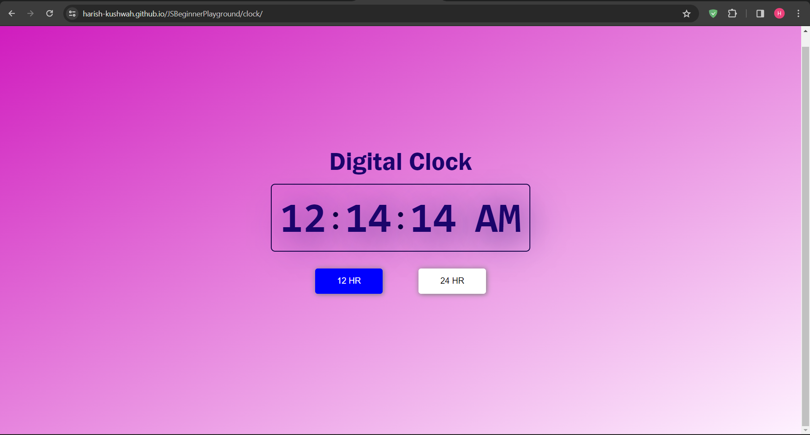

# Digital Clock Project

Welcome to the Digital Clock project, an engaging exploration into JavaScript timekeeping! This project provides a hands-on experience in manipulating the Date object and dynamically updating the user interface.

## Project Highlights:

- **Real-Time Display**: Witness the magic of JavaScript as the digital clock updates in real-time.
- **Interactive Design**: A clean and intuitive user interface that showcases the current time with clarity.
- **JavaScript Mastery**: Learn how to leverage JavaScript's Date object for time-related functionality.

## Features:

1. **Current Time Display**: The digital clock prominently displays the current time, including hours, minutes, and seconds.
2. **Automatic Updates**: Thanks to JavaScript, the clock updates automatically, ensuring accurate and up-to-date time information.
3. **User-Friendly Interface**: The design is crafted with user experience in mind, providing a straightforward and visually appealing representation of time.

## How to Use:

1. **Open the Project**: Visit the live [Digital Clock](https://harish-kushwah.github.io/JSBeginnerPlayground/clock) to see the clock in action.
2. **Explore the Code**: Dive into the [source code](https://github.com/Harish-Kushwah/JSBeginnerPlayground/tree/main/clock) to understand how JavaScript powers the clock.

## Getting Started
1. Clone this repository: `git clone https://github.com/Harish-Kushwah/JSBeginnerPlayground.git`
2. Explore the projects by opening the `index.html` file in your browser.
3. Dive into individual projects by clicking on the provided links..

## Takeaway:

The Digital Clock project is a perfect starting point to grasp the basics of handling time in JavaScript. Whether you're a coding beginner or looking to reinforce your skills, this project offers an insightful journey into the world of dynamic web applications. Happy coding! 🕒